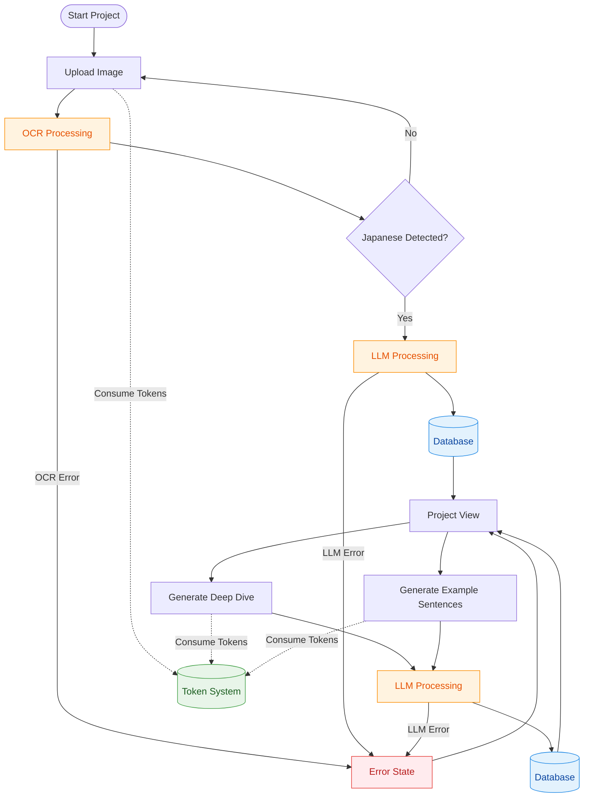

# Summer 2026 Update

Open to full stack IC or contract opportunities.

## Current Project: AI Japanese Learning Tool
Building a full-stack SaaS that turns user-uploaded images into Japanese learning content using LLM APIs.

**Status:** Live in production. Demo available on request.

## Core Overview

